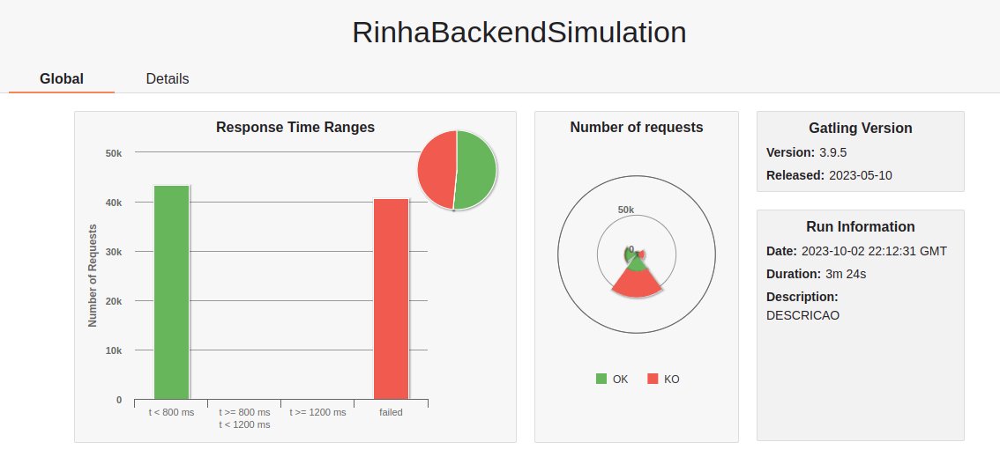

# Rinha de Backend em GO

A backend challenge, here the instructions (in portuguese): [Rinha de Backend](https://github.com/zanfranceschi/rinha-de-backend-2023-q3/blob/main/INSTRUCOES.md)

## Endpoints

- [x] `pessoas` [POST] endpoint
- [x] `pessoas/:id` [GET] endpoint
- [x] `pessoas?t=` [GET] endpoint
- [x] `contagem-pessoas` [GET] endpoint

## Performance

### Observations

- I wasn't able to make `network_mode: host` work in docker-compose (I tried, but nginx coudn't find `localhost:3000` or `localhost:3001`).
- There might be validation errors that I've missed.
- I'm using `pq`, which is a pure Go Postgres driver, but it seems to not be maintained anymore (don't know for sure).
- I'm using the stress test without the `randomize` line.

### Results



*For curious people, the html file with the results will be available in the `./assets` folder.*

- *Test output*:

```bash
---- Requests ------------------------------------------------------------------
> Global                                                   (OK=43427  KO=40785 )
> busca inválida                                           (OK=3702   KO=488   )
> busca válida                                             (OK=2658   KO=6932  )
> criação                                                  (OK=21688  KO=32872 )
> consulta                                                 (OK=15379  KO=493   )
```

*Obs: I got this much of `j.i.IOException erros:`*

```bash
> j.i.IOException: Premature close                                 8981 (22.02%)
```
